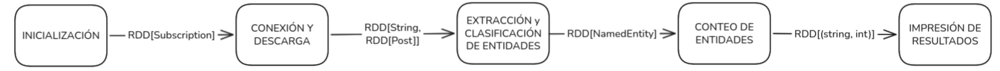

# INFORME

## Ejercicio 1

### a) Diagrama de flujo

### b) Abstracciones de Spark
- Inicialización: al ser solo la lectura del archivo JSON que contiene las suscripciones a través del driver, no encaja con ninguna abstracción de Spark.
- Conexión y descarga: puede expresarse como un map, ya que por cada conexión crea una tupla con el URL y la lista de posts.
- Extracción y clasificación de entidades: puede expresarse como un flatMap, ya que por cada post puede crear una lista de cero o más NamedEntity.
- Conteo de entidades: puede expresarse con un reduceByKey, ya que agrupa las NamedEntitys por tipo y nombre.
- Impresión de resultados: al ser impresión de datos por pantalla, paralelizarlo podría producir que la información que sale por pantalla no sea legible o no tenga el formato deseado.

### c) Barreras de sincronización
Los pasos del pipeline que son barreras de sincronización serían "Conteo de entidades" e "Impresión de resultados". Como "Conteo de entidades" está implementado con un reduceByKey, todos los resultados no pueden ser procesados por "Impresión de resultados" hasta que estén completos, porque usamos collect para los resultados obtenidos anteriormente.
En cambio, Conexión y descarga, y Extracción y clasificación de entidades, pueden ejecutarse de forma completamente independiente. Esto es posible porque usan flatMap y map, donde cada post se procesa y crea su propia lista de entidades.

### d) Restricciones del mecanismo de extensión de Spark
Dada la paralelización de los workers con Spark, las restricciones del mecanismo de extensión están definidas por las siguientes características:
- Serialización: Cuando le pasás una función en el Driver, Spark tiene que empaquetar ese código y enviarlo a través de la red hacia todos los Workers. Por lo tanto, tanto la función como cualquier variable externa que la función utilice adentro deben ser serializables. Si intentás usar objetos no serializables, el programa va a crashear con una excepción de serialización.
- Estado compartido: Dado que los workers son procesos independientes, si la función intenta modificar una variable externa normal, cada worker modificará una copia local de esa variable. El valor original en el Driver nunca cambiará.
- Efectos secundarios: Las funciones que se pasan a Spark deberían ser "puras" (como lo define el paradigma funcional). Si un worker falla por un problema de red o falta de memoria, Spark es tolerante a fallos y puede volver a ejecutar esa misma tarea en otro worker. Si la función tenía un efecto secundario, al reejecutarse la tarea podría volver a producir ese efecto secundario.

## Ejercicio 2
### ¿Qué pasaría si dejaramos propagar la excepción?
Si en lugar de capturar el error adentro del flatMap dejaramos que la excepción se propague, pasarían estas cosas en cadena:
1. Spark reintenta la tarea. Cuando un worker lanza una excepción, Spark no falla inmediatamente. Primero reintenta la tarea en otro worker (por defecto 3 veces). Esto significa que esa descarga HTTP fallida se va a intentar 3 veces más, gastando tiempo y recursos innecesariamente.
2. Si todos los reintentos fallan, falla la partición entera
Una partición puede contener varias suscripciones. Si una falla y no se captura, todas las suscripciones de esa partición se pierden, no solo la que falló.
3. Si la partición era crítica, falla el job completo Spark termina el programa con una excepción como SparkException: Job aborted due to stage failure. No obtenemos ningún resultado parcial, todo el trabajo que hicieron los otros workers se descarta.

##Ejercicio 3
a) flatMap — extraer entidades de cada post
¿Qué hace?
Para cada Post del RDD, combinamos el título y el cuerpo en un solo string y llamamos a Analyzer.detectEntities, que devuelve una List[NamedEntity] con todas las entidades del diccionario que aparecen en ese texto.

¿Por qué flatMap y no map?
Porque map esperaría que cada post produzca exactamente un resultado, pero acá cada post puede producir cero, una o muchas entidades. flatMap "aplana" esas listas: si el post A tiene 3 entidades y el post B tiene 0, el RDD resultante tiene directamente esas 3 entidades, sin listas anidadas.

Resultado: RDD[NamedEntity] — un RDD donde cada elemento es una entidad
detectada en algún post (puede haber duplicados, eso es intencional).

¿Dónde se ejecuta? En los workers. Cada worker procesa su partición del RDD de
posts de forma completamente independiente del resto.

b)map — convertir cada entidad en un par clave-valor
¿Qué hace?
Transforma cada NamedEntity en una tupla de la forma ((tipo, nombre), 1).
Por ejemplo, si la entidad es ProgrammingLanguage("Scala"), produce:
(("ProgrammingLanguage", "Scala"), 1)
El 1 es el "voto": cada vez que aparece una entidad, aporta 1 al conteo final.

¿Por qué esta estructura?
Porque reduceByKey (el siguiente paso) necesita pares (clave, valor). La clave es la tupla (tipo, nombre) — que identifica unívocamente a cada entidad — y el valor es el número a sumar.

Resultado: RDD[((String, String), Int)]

¿Dónde se ejecuta? En los workers. Es una transformación 1-a-1, completamente
paralela e independiente.

c) reduceByKey — sumar los conteos por entidad
¿Qué hace?
Agrupa todos los pares que tienen la misma clave (tipo, nombre) y aplica la función _ + _ (suma) sobre sus valores. Si "Scala" apareció 5 veces en el worker 1 y 3 veces en el worker 2, el resultado final para esa clave es 8.

Resultado: RDD[((String, String), Int)] — pero ahora sin duplicados: cada
entidad aparece exactamente una vez con su conteo total.

¿Dónde se ejecuta? Acá es donde ocurre algo diferente a los pasos anteriores: esto es una barrera de sincronización.

d) Ordenar y mostrar los resultados
¿Qué hace?
Una vez que tenemos el RDD con los conteos finales, lo traemos al driver con collect() y lo convertimos a un Map. Luego usamos los formateadores del esqueleto (formatTypeStats y formatEntityStats) que ya estaban implementados, para imprimir las estadísticas en el formato correcto.

formatEntityStats internamente ordena por conteo descendente, luego por tipo y
nombre alfabéticamente, y toma los primeros topK resultados.

¿Qué ocurre en el cluster durante reduceByKey? ¿Por qué es inevitable?

reduceByKey es una barrera de sincronización porque el conteo total de una entidad depende de todos los posts, no de uno solo. Ningún worker puede producir el resultado final de "cuántas veces apareció Scala en total" hasta que todos los demás hayan terminado de procesar sus posts.

Lo que ocurre internamente en Spark se llama shuffle:

1.Cada worker termina de calcular sus pares (clave, 1) locales.
2.Spark redistribuye los datos: todos los pares con la misma clave son enviados al mismo worker, sin importar en qué partición estaban originalmente.
3.Cada worker recibe todos los pares de "sus" claves y aplica la función de reducción (_ + _) para obtener el conteo final.

Es inevitable porque el problema lo requiere: necesitamos un conteo global, y los datos están distribuidos. No hay forma de calcular un agregado global sin que todos los workers comuniquen sus resultados parciales.

¿Qué restricciones debe cumplir la función pasada a reduceByKey?
La función debe ser:

Asociativa: f(f(a, b), c) == f(a, f(b, c)). Spark puede combinar los valores en
cualquier orden y en múltiples etapas (primero combina dentro de cada worker, luego entre workers). Si la función no fuera asociativa, el resultado dependería del orden de combinación y sería incorrecto.

Conmutativa: f(a, b) == f(b, a). Spark no garantiza el orden en que llegan los
valores al reducer. Si la función no fuera conmutativa, el resultado cambiaría según el orden de llegada.

La suma (_ + _) cumple ambas propiedades, por eso es la función ideal para conteo.Un contraejemplo que no funcionaría correctamente sería la resta (_ - _): no es conmutativa ni asociativa, por lo que daría resultados distintos según el orden de procesamiento.

¿Dónde se hace la lectura del diccionario de entidades? ¿En el driver o en los workers?

La lectura del diccionario se hace en el driver, antes de que comience el pipeline de Spark:

val dictionary = Dictionary.loadAll(cmdArgs.entitiesDir)  // ←  Se ejecuta en el driver

Cuando el flatMap se ejecuta en los workers, el dictionary es una variable local
capturada en el closure de la función. Spark serializa ese objeto y lo envía a cada worker junto con la tarea.

Implicación: para diccionarios pequeños (como los archivos .txt de este lab), esto es correcto y eficiente. Sin embargo, si el diccionario fuera muy grande (millones de entradas), serializar y enviar una copia a cada worker sería costoso en red y memoria. En ese caso, la solución correcta sería usar una broadcast variable:

val dictBroadcast = sc.broadcast(dictionary)

val entitiesRDD = filteredPostsRDD.flatMap { post =>
  Analyzer.detectEntities(combinedText, dictBroadcast.value)
}

Una broadcast variable se envía una sola vez a cada máquina (no a cada tarea), lo que reduce significativamente el tráfico de red cuando hay muchas particiones.

## Ejercicio 4
### a) ¿Por qué los Accumulators solo deben usarse para métricas y no para tomar decisiones lógicas dentro de las etapas distribuidas del pipeline? ¿En qué situación un Accumulator puede dar un valor incorrecto?
Los Accumulators están diseñados exclusivamente para operaciones de solo escritura desde el punto de vista de los workers. El clúster no garantiza que un worker pueda leer el valor acumulado por otro en tiempo real durante la ejecución de una etapa distribuida. Si se intentara utilizar el valor de un acumulador para alterar el flujo lógico o aplicar un condicional (if/else) dentro de un map o filter, el comportamiento del programa sería indeterminado, rompiendo el paradigma funcional y de inmutabilidad sobre el que se construye Apache Spark.
Un acumulador puede arrojar un valor duplicado o incorrecto cuando se encuentra dentro de una transformacion si se produce un error dentro de esta. Esto entraria dentro del caso de efectos secundarios que mencionamos antes, donde Spark vuelve a ejecutar el worker despues del error, modificando el accumulator nuevamente. 

### b) ¿En qué momento del pipeline está disponible el valor de un Accumulator para ser leído por el driver?
El valor de un Accumulator solo se encuentra disponible y consolidado para ser leído por el driver únicamente después de que una acción terminal se haya completado con éxito (por ejemplo, luego de un .count() o un .collect()). Esto se debe a que el accumulator no es procesado hasta que todos los workers envien sus contadores al driver. Si se intenta leer antes de la acción terminal, el acumulador devolverá siempre su valor inicial (0).

### c) Comparen el tiempo que tarda cada etapa del pipeline que midieron en la versión no paralelizada y la versión con Spark. ¿Qué conclusiones pueden sacar? Para la cantidad de datos que estamos trabajando, ¿se aprecia la diferencia? Justifique por qué. Nota: La comparación debe realizarse en ejecuciones sobre la misma computadora y la misma conexión a internet.

## Ejercicio 5
### a) ¿Qué ocurriría si no llamaran a cache()? ¿Cuántas veces se ejecutaría la descarga de feeds?
Cuando no se llama a cache() cada vez que se usa un RDD desde el driver vuelve a ejecutar los pasos del pipeline requeridos para llegar a ese RDD.
En el caso de la descarga de feeds, como era el primer paso del pipeline era el que mas se repetia. En nuestro caso esto sucedia 5 veces por cada llamada de filteredPostsRDD que se usaba en main.

### b) ¿Por qué es incorrecto llamar a collect() entre los pasos a) y b) del ejercicio 3 y luego continuar el pipeline? ¿Qué consecuencia tiene sobre la distribución deltrabajo?
Es incorrecto llamar el collect() entre el flatmap del paso a) (entitiesRDD) y el map del paso b) (paresRDD) fuerza al driver a juntar los resultados de todos los workers ejecutando el paso a) antes de pasar al b). Esto rompe la paralelizacion de ambos pasos en el pipeline.

### c) cache() es también lazy. ¿En qué momento se almacena realmente el RDD en memoria?
Al usar cache() el RDD se almacena en memoria cuando se produce su primer accion terminal. Esto le da una ventaja sobre collect si el driver llama mas de una vez al RDD.
